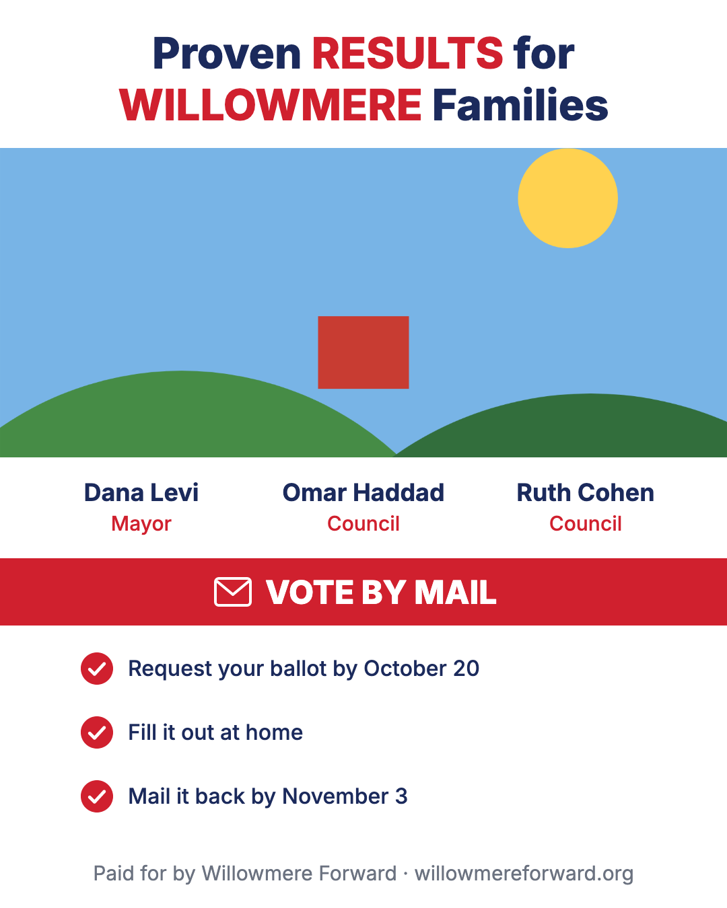
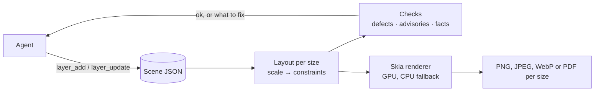

# keyline-mcp

**An image composition engine that only an AI agent drives.** The agent describes a design once as a small JSON scene through [MCP](https://modelcontextprotocol.io) tools. A Rust renderer built on [Skia](https://skia.org) turns it into images at every size you need: portrait post, landscape banner and skyscraper ad from one master layout. There's no browser anywhere in the pipeline.

> Status: early development. The scene format and the tools still change.



<sub>A test ad built through the tools and rendered by the engine. Same scene, [wide](tests/golden/macos/reference-wide.png) and [skyscraper](tests/golden/macos/reference-sky.png) sizes.</sub>

---

## Why

Most designs people ship today (sale posts, event flyers, ad sets) are made in tools like Canva or Adobe Express. Those tools are built for a person with a mouse, and none is a good backend for an agent:

- **Canva and Adobe Express** keep their scene graph private: you can export pixels, not the design.
- **Browser-based renderers** such as Polotno need headless Chrome on the server.

keyline-mcp is the missing piece: a design format and renderer built from the ground up for a language model to author, check and export, cheaply and reproducibly.

## How it works



1. **One master layout.** The scene is designed once, at a master size (say 1080×1350), and lists the target sizes.
2. **Layouts that adapt.** Frames lay their children out as rows and columns (like CSS flexbox or Figma auto layout) or as a grid, and children size themselves with `hug`, `fill` or a percentage. A row can fall back to a column where it doesn't fit, and `firstFit` draws the first of several alternatives that fits. Free-placed layers follow design-tool constraints (`left`, `right`, `center`, `stretch`, `scale`) or pin to a spot such as `bottom-right`. Each size may have a scale factor, like a design tool's Scale tool, and any layer can change for one size, or for every portrait, landscape, wide or tall size (`at`). It uses no constraint solver: that's where layout systems get slow and agent-written layouts become undebuggable.
3. **Text that fits its box.** Give text a width and height and the font shrinks to fit (down to `minFontScale`), then ends with an ellipsis. Give it a width only and it wraps and grows down. Give it no box and it's one line.
4. **GPU by default, deterministic when it matters.** Renders run on the GPU (Metal on macOS, Vulkan on Linux and Windows) and fall back to the CPU when there's none. The CPU path is deterministic, so tests compare it against reference images (allowing for glyph anti-aliasing, which differs slightly between OS versions). Fonts are bundled or downloaded, never taken from the machine.

## LLM-first, and LLM-only

There's no GUI, and no plan for one. Every design decision is judged by one question: *how many tokens does the agent spend to get a correct image?* We measure that with a real model (Claude, through Claude Code) building a real multi-section ad. How the tools keep it low:

- **Few, batched tools.** There are six tools, not one per property. A mutation takes a list of operations and applies them all or none; one call can build a whole ad.
- **Short replies.** Edits never echo the scene back. They return the changed ids, a version, and `ok` or the problems found.
- **Defaults left out.** Every field has a documented default and defaults are never sent or stored, so a typical layer is 4–6 fields.
- **Semantic targets.** Layers are addressed by `role`, so the agent never reads the scene just to find an id, and one edit can hit every layer with that role.
- **The server measures, and says how to fix it.** Warnings carry the answer, e.g. `!overflow needs 400×124 (one line: 440 wide)` or `!clipped by head: bottom 8px`, so the agent fixes it in one step instead of guessing.
- **Verification without pixels.** Every edit reply includes three kinds of feedback, for every size:

  | Kind | Example | The agent should |
  |---|---|---|
  | Defect | `!overflow`, `!truncated`, `!clipped`, `!hidden`, `!overlaps` | fix it |
  | Advisory | `warn contrast 2.1:1 (WCAG 4.5)` | judge it |
  | Fact | `smallest text: portrait 30px, sky 8.4px (footer)` | decide whether it suits the medium |

  `render` also reports how each wrapped, shrunk or cut text was actually drawn. We learned that preview images cost more *and* catch less: Claude approved 7 px text from a 512 px preview, and the server's measurements catch it. So previews are opt-in, and come as one small image of all sizes side by side.
- **Names, not inventions.** Icons and shapes (ribbons, bursts, blobs…) come by name, and repeated looks are named styles, tokens and components. Before icons, the model spent most of its tokens designing SVG paths in its head; with them, rebuilding a real flyer went from $0.22–0.62 to $0.15–0.19 per run.
- **Measured, not guessed.** Every change is judged on several real-model runs, since identical runs vary up to 2× in cost. The runs are kept in [bench/](bench/reference-ad/), with prompts, logs and renders.
- **Taste stays with the model.** The server flags only objective defects. Whether 8 px text is fine print or unreadable depends on where the ad runs, so the server reports the size and the model decides.

## Features

- **Layers:** `text`, `image` (PNG, JPEG, SVG), `icon`, `rect`, `ellipse` (and arcs and rings), `polygon` (and stars), `path` (SVG path data or a named shape), `line`, `frame` (nesting, clipping, stacks, grids), `spacer`, `firstFit`, and `use` for components
- **Layout:** stacks (rows and columns with gap, padding, alignment, justification and wrapping; `fill`, `grow` and priorities), grids (CSS-style tracks, named areas, spans), `hug`/`fill`/percentage sizes with min/max and aspect ratio, direction lists and `firstFit` that pick what fits, constraints, placement at nine spots, a scale factor per size, per-size and per-aspect changes (`at`), size presets for common social and ad formats, and safe areas a platform covers
- **Text:** fit, wrap or one line; inline markup (`<b>`, `<i>`, `<span color=…>`, style names as tags); weights, italics, letter spacing, line height, case; balanced or pretty wrapping; highlights behind words; underline and strike; text on a curve; dot leaders; text filled with an image, pattern or gradient; outlines; text that knocks out its frame. Fonts work like CSS web fonts: name any [Google Fonts](https://fonts.google.com) family and the server downloads it on first use and caches it (tracked in `fonts/index.json`); [Inter](https://rsms.me/inter/) is bundled, and you can add your own font files
- **Paint:** stacked fills (solid, linear/radial/conic gradients, images, patterns, film grain), strokes (inside, center or outside, per side, dashed, with arrowheads, hand-drawn), shadows (outer and inner, following a cutout's or text's shape), blur and backdrop blur, masks (gradient, shape, path, another layer or an image), torn edges, 16 blend modes, corner radius, rotation, skew, flips
- **Images:** fill, fit, crop or tile, with a focus point that stays in view; adjustments (brightness, contrast, saturation, grayscale, sepia, hue, duotone, tint, halftone)
- **Icons:** about 5,000 built in, by name: [Lucide](https://lucide.dev) outline icons and [Font Awesome Free](https://fontawesome.com) solid, regular and brand icons, in any color
- **Reuse:** named styles on any layer, tokens (`"$brand"`) that update every field using them, and components placed once or once per data row
- **Assets:** stored under content hashes. URLs are fetched only over http(s), and private and local addresses are refused.
- **Output:** PNG, JPEG, WebP or vector PDF per size, with a file-size cap for ad networks, plus an optional contact-sheet preview; rendered on the GPU when available

## Quick start

**Linux:** download the `.deb` for your machine (amd64 or arm64) from the latest release and install it; it puts `keyline-mcp` in `/usr/bin`. A plain tarball of the binary is there too.

```sh
sudo apt install ./keyline-mcp_<version>-1_amd64.deb
```

**macOS (Apple silicon):** download `keyline-mcp-<version>-macos-arm64.tar.gz` from the latest release, unpack it and put `keyline-mcp` on your PATH. The binary isn't signed by Apple, so if you downloaded it in a browser, clear the quarantine flag once:

```sh
tar xzf keyline-mcp-<version>-macos-arm64.tar.gz
sudo mv keyline-mcp-<version>-macos-arm64/keyline-mcp /usr/local/bin/
xattr -d com.apple.quarantine /usr/local/bin/keyline-mcp 2>/dev/null || true
```

**From source** (any OS; requires Rust stable; Skia comes precompiled; on Linux also `libfontconfig1-dev libfreetype6-dev`):

```sh
cargo build --release
```

**Claude Code:**

```sh
claude mcp add keyline-mcp -- keyline-mcp   # or the path to target/release/keyline-mcp
```

**Any other MCP client** (stdio):

```json
{
  "mcpServers": {
    "keyline-mcp": { "command": "/path/to/keyline-mcp/target/release/keyline-mcp" }
  }
}
```

The server speaks MCP over stdio, so it runs where your MCP client runs. To render on another machine, make the command `ssh that-machine keyline-mcp`.

Then ask your agent for a design: *"Make a vote-by-mail flyer with this photo, in 1080×1350, 1200×1000 and a 300×600 skyscraper."*

| Environment variable | Default | Purpose |
|---|---|---|
| `KEYLINE_MCP_DATA` | `~/.keyline-mcp` | Scenes, assets, renders and the web-font cache. Tool arguments are never file paths. |
| `KEYLINE_MCP_FONTS` | none | Extra folder of `.ttf` and `.otf` fonts; `<data>/fonts` is loaded too |
| `KEYLINE_MCP_RENDERER` | `gpu` | `gpu` renders on the GPU and falls back to the CPU; `cpu` always uses the CPU |

**GPU on a Linux server:** it needs a GPU with Vulkan drivers (NVIDIA's, or Mesa for AMD and Intel); no display is needed. In Docker, pass the GPU through (for NVIDIA: the Container Toolkit, `--gpus all`, with graphics capability) and install `libvulkan1`. Software Vulkan drivers are skipped, since the CPU renderer is faster; without a GPU, renders use the CPU.

## The tools

Every input and reply format is in [docs/tools.md](docs/tools.md).

| Tool | Does | Replies |
|---|---|---|
| `scene_create` | New scene: master size, target sizes, background | `s5b0a42a5e v0` |
| `asset_add` | Adds an image from a URL or base64 | `photo 1600×900 v1` |
| `layer_add` | Adds layers, optionally into a `parent` frame, and shared `styles`, `tokens` and `components` | `added headline,cta v2 ok` and facts |
| `layer_update` | Changes (`set`), deletes or detaches layers, styles and components; changes tokens | `changed … v3`, then problems or `ok` |
| `scene_describe` | Problems per size, or `ok`; `full` lists every layer's box | text |
| `render` | PNG, JPEG, WebP or PDF for all or some sizes; `maxKB` caps file size; `preview` adds a contact sheet | paths and how text was drawn |

A typical call:

```json
{
  "sceneId": "s5b0a42a5e",
  "layers": [
    { "id": "headline", "type": "text", "text": "Proven RESULTS for WILLOWMERE Families",
      "x": 60, "y": 40, "width": 960, "fontSize": 64, "weight": 800, "align": "center",
      "color": "#1B2A5C", "ranges": [{ "start": 7, "end": 14, "color": "#D0202E" }],
      "constraints": { "h": "stretch", "v": "top" } },
    { "type": "image", "asset": "photo", "y": 220, "width": 1080, "height": 460,
      "constraints": { "h": "stretch", "v": "stretch" } },
    { "id": "cta", "type": "frame", "y": 830, "width": 1080, "height": 100, "color": "#D0202E",
      "constraints": { "h": "stretch", "v": "bottom" },
      "children": [
        { "id": "cta-text", "type": "text", "text": "VOTE BY MAIL", "x": 394, "y": 21, "fontSize": 48,
          "weight": 800, "color": "#FFFFFF", "constraints": { "h": "center", "v": "center" } }
      ] }
  ]
}
```

and its reply, for the sizes the tests use (1080×1350 at full scale, 1200×1000 at 0.85, a 300×600 skyscraper at 0.28):

```text
added headline,image1,cta v2 ok
smallest text: portrait 48px (cta-text), wide 41px (cta-text), sky 13px (cta-text)
```

## Development

```sh
cargo test                                         # unit and end-to-end tests
UPDATE_GOLDEN=1 cargo test --test e2e              # regenerate reference PNGs (deliberately; also e2e_features, e2e_paint, …)
cargo test --test llm_e2e -- --ignored --nocapture # a real model builds an ad; prints cost
cargo test -- --ignored web_fonts google_fonts     # web fonts download once and stay cached (network)
KEYLINE_MCP_BENCH=<label> cargo test --test llm_e2e -- --ignored --nocapture       # keep the run in bench/reference-ad/
KEYLINE_MCP_BENCH=<label> cargo test --test recreate_e2e -- --ignored --nocapture  # rebuild a local design from its image, scored
```

- **Unit tests** cover layout, text fitting, rendering down to pixel checks, storage, URL safety and edits.
- **Layout tests** check every layer's position and size after layout, without rendering.
- **End-to-end tests** run the real server over stdio, build designs in several sizes, and compare the PNGs with reference images. The images are kept per OS, since glyph rasterization differs by platform, and compared with a small tolerance, since glyph edges also differ slightly between OS versions.
- **The LLM tests** run Claude Code headless, so they use a Claude subscription and need no API key. They check that no defects remain and report tool calls, tokens and API-equivalent cost. With `KEYLINE_MCP_BENCH` they keep each run for comparison: the reference ad in [bench/reference-ad/](bench/reference-ad/), and a design rebuilt from its image (kept in the gitignored `bench/recreate/local/`, since references are often real people's material), scored by how close it looks.
- **Releases:** pushing a `v*` tag builds the Linux `.deb` and tarball (amd64 and arm64) and attaches them to a GitHub release.

Contributions follow [CLAUDE.md](CLAUDE.md): Rust only, `cargo fmt` and `clippy -D warnings` must pass, changes are reviewed against the [rust-skills](https://github.com/leonardomso/rust-skills) rules, new dependencies need approval and must be permissively licensed, and every feature comes with unit and end-to-end tests.

## License

[PolyForm Shield 1.0.0](LICENSE): free to use, modify and redistribute, commercially too, for any purpose **except providing a product that competes with keyline-mcp or with any product the author provides using it**, which includes offering it as a hosted service. For a license to do that, contact the author.

Third-party parts keep their own licenses: Skia (BSD-3-Clause) through the skia-safe bindings (MIT), resvg (Apache-2.0 or MIT), rmcp (Apache-2.0), Inter ([SIL OFL 1.1](fonts/OFL.txt)), Lucide icons ([ISC](icons/LICENSE-lucide.txt)) and Font Awesome Free icons by Fonticons, Inc. ([CC BY 4.0](icons/LICENSE-fontawesome.txt)).
