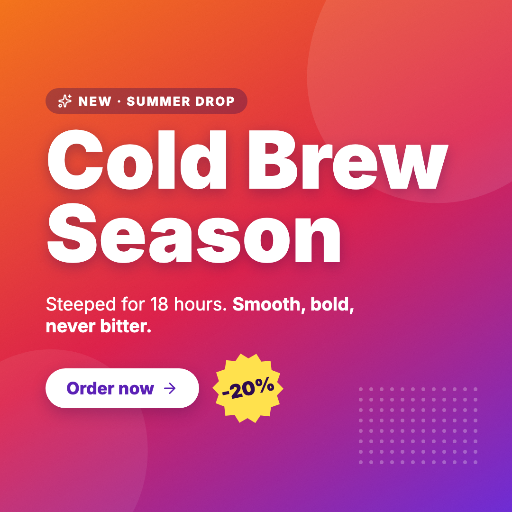
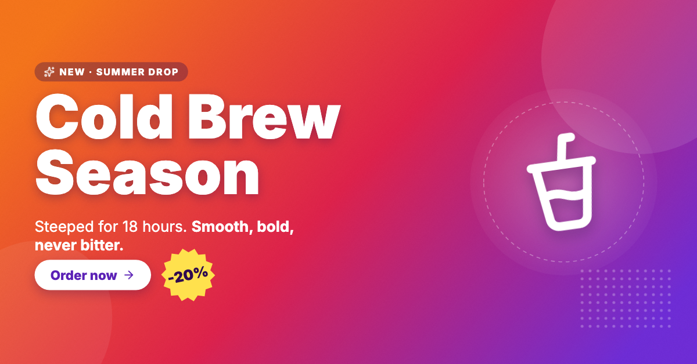
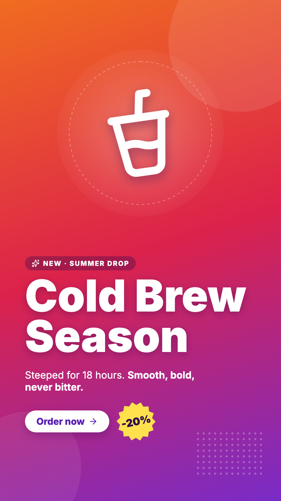
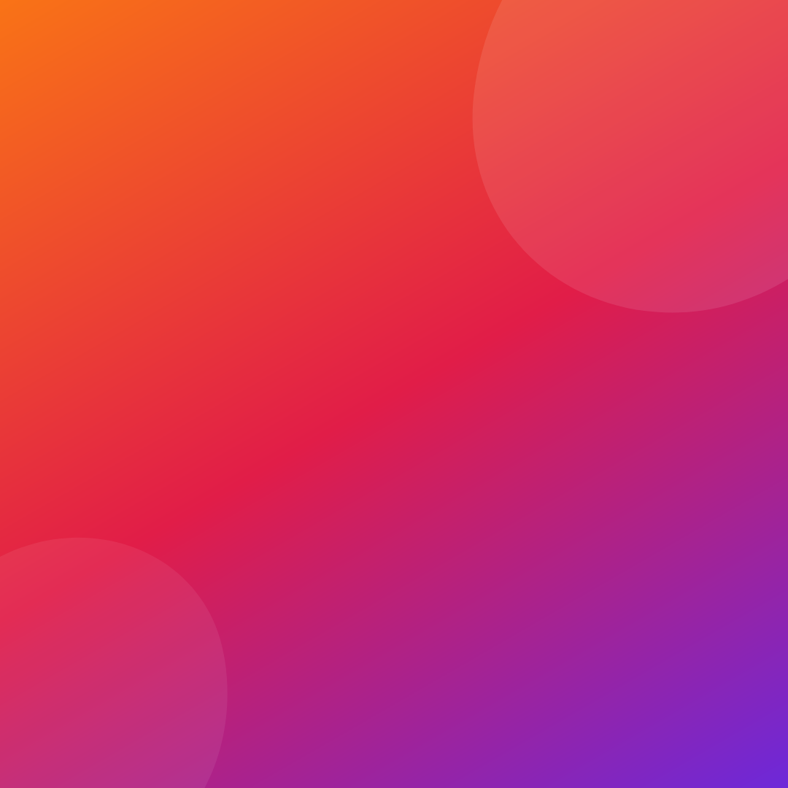
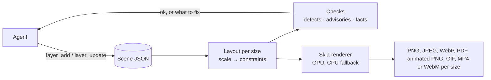

# keyline-mcp

**An AI-native design engine: agents design, keyline renders. No Chrome, no browser.** An AI agent (Claude Code, Cursor, Cline or any [MCP](https://modelcontextprotocol.io) client) describes a design once as a small JSON scene. A Rust renderer built on [Skia](https://skia.org) turns it into PNG, JPEG, WebP, vector PDF, animated PNG, GIF, MP4 or WebM at every size you need: portrait post, landscape banner and skyscraper ad from one master layout. Output is deterministic: no model generates pixels, so the same scene always renders the same design. There's no browser anywhere in the pipeline: no headless Chrome, Puppeteer or Playwright to install, run or keep patched on the server, just one native binary.

Think of it as Figma or Canva for AI agents: a design tool whose only user is a language model, for social posts, display ads, flyers, banners and other marketing images.

> Status: early development. The scene format and the tools still change.

<p align="center">
  
  
  
</p>

<p align="center">One scene, three sizes: a square post, a wide banner and a story, each laid out by the engine from a single design (<a href="tests/fixtures/showcase.json">the scene</a>).</p>

<p align="center">
  
</p>

<p align="center">The same design with motion, rendered as an animated PNG with no browser and no video tool (<a href="tests/fixtures/showcase-motion.json">the scene</a>).</p>

---

## Why

Most designs people ship today (sale posts, event flyers, ad sets) are made in tools like Canva or Adobe Express. Those tools are built for a person with a mouse, and none is a good backend for an agent:

- **Canva and Adobe Express** keep their scene graph private: you can export pixels, not the design.
- **Browser-based renderers** such as Polotno need headless Chrome on the server.

keyline-mcp is the missing piece: an agent-first design tool, with a design format and renderer built from the ground up for a language model to author, check and export, cheaply and reproducibly. The design stays structured data (a typed layer tree with layout, tokens, styles and components), not pixels, so an agent edits it precisely instead of regenerating an image.

## How it works



1. **One master layout.** A design is written once at a master size and lists its target sizes.
2. **Layouts that adapt.** Rows, columns, grids and design-tool constraints lay the design out again at every size, with no constraint solver; any layer can change for one size or aspect class.
3. **Checks, not previews.** Every edit's reply says what's wrong at each size, with the measurement that fixes it.
4. **GPU by default, deterministic when it matters.** Renders run on the GPU and fall back to the CPU, whose output is exactly repeatable.

**Start here:** [docs/concepts.md](docs/concepts.md) explains the model; [docs/scene.md](docs/scene.md) is the scene format and [docs/tools.md](docs/tools.md) the tools and configuration.

## LLM-first, and LLM-only

There's no GUI, and no plan for one. Every design decision is judged by one question: *how many tokens does the agent spend to get a correct image?* We measure that with a real model (Claude, through Claude Code) building a real multi-section ad.

- **Few, batched tools:** six tools, not one per property; one call can build a whole ad.
- **Short replies:** edits return the changed ids, a version, and `ok` or the problems, never the scene.
- **Defaults left out:** a typical layer is 4–6 fields.
- **Standard names:** CSS names and values wherever CSS has the concept (flexbox and grid fields on frames, `fontWeight`, `borderRadius`, `rgba()` colors), so the model writes a scene right the first time. The layout itself is keyline's own, documented, not browser-exact.
- **Semantic targets:** layers are addressed by `role`, so the agent never reads the scene to find an id.
- **Verification without pixels:** defects to fix, advisories to judge and facts to weigh, each with the measurement that fixes it ([how](docs/concepts.md#checks-defects-advisories-facts)).
- **Names, not inventions:** icons, shapes, styles, tokens and components by name. Icons alone took rebuilding a real flyer from $0.22–0.62 to $0.15–0.19 per run.
- **Measured, not guessed:** every change is judged on several real-model runs, kept in [bench/](bench/reference-ad/).
- **Taste stays with the model:** the server flags only objective defects and reports the rest as facts.

## Features

- **Layers:** `text`, `image` (PNG, JPEG, SVG), `video`, `icon`, `rect`, `ellipse` (and arcs and rings), `polygon` (and stars), `path` (SVG path data or a named shape), `line`, `frame` (nesting, clipping, stacks, grids), `spacer`, `firstFit`, and `use` for components
- **Layout:** stacks (CSS flexbox: rows and columns with gap, padding, alignment, justification and wrapping; `fill`, `flexGrow` and priorities), grids (CSS grid: tracks, named areas, spans), `hug`/`fill`/percentage sizes with min/max and aspect ratio, direction lists and `firstFit` that pick what fits, constraints, placement at nine spots, a scale factor per size, per-size and per-aspect changes (`media`), size presets for common social and ad formats, and safe areas a platform covers
- **Text:** fit, wrap or one line; inline markup (`<b>`, `<i>`, `<span style=…>`, style names as tags); weights, italics, letter spacing, line height, case; balanced or pretty wrapping; highlights behind words; underline and strike; text on a curve; dot leaders; text filled with an image, pattern or gradient; outlines; text that knocks out its frame. Fonts work like CSS web fonts: name any [Google Fonts](https://fonts.google.com) family and the server downloads it on first use and caches it (tracked in `fonts/index.json`); [Inter](https://rsms.me/inter/) is bundled, and you can add your own font files
- **Paint:** stacked fills (solid, linear/radial/conic gradients, images, patterns, film grain), strokes (inside, center or outside, per side, dashed, with arrowheads, hand-drawn), shadows (outer and inner, following a cutout's or text's shape), blur and backdrop blur, masks (gradient, shape, path, another layer or an image), torn edges, 16 blend modes, corner radius, rotation, skew, flips
- **Images:** fill, fit, crop or tile, with a focus point that stays in view; adjustments (brightness, contrast, saturation, grayscale, sepia, hue, duotone, tint, halftone)
- **Icons:** about 5,000 built in, by name: [Lucide](https://lucide.dev) outline icons and [Font Awesome Free](https://fontawesome.com) solid, regular and brand icons, in any color
- **Reuse:** named styles on any layer, tokens (`"$brand"`) that update every field using them, components placed once or once per data row, and templates: a scene file loaded by URL or path with its variables set, rendered once per row of values
- **Motion:** GSAP-style animation: enter and exit effects (fade, fade-up, pop, zoom, blur-in), keyframes on opacity, scale, rotation, offset, skew, blur and color with GSAP's eases, `random()` starts, staggered children, and text split into letters or words that move on their own
- **Video:** video clips as layers, trimmed, slowed or looped, with titles and graphics over them; shots that play in turn, joined by cuts, fades, slides, pushes, wipes or zooms; each clip's own sound carried into the video
- **Assets:** stored under content hashes. URLs are fetched only over http(s), and private and local addresses are refused.
- **Output:** PNG, JPEG, WebP, vector PDF, animated PNG, animated GIF, MP4 or WebM per size, a still of any moment, with a file-size cap for ad networks, plus an optional contact-sheet preview; rendered on the GPU when available

## Quick start

**Linux:** download the `.deb` for your machine (amd64 or arm64) from the latest release and install it; it puts `keyline-mcp` in `/usr/bin`. A plain tarball of the binary is there too.

```sh
sudo apt install ./keyline-mcp_<version>-1_amd64.deb
```

**macOS (Apple silicon):** download `keyline-mcp-<version>-macos-arm64.tar.gz` from the latest release, unpack it and put `keyline-mcp` on your PATH. The binary isn't signed by Apple, so if you downloaded it in a browser, clear the quarantine flag once:

```sh
tar xzf keyline-mcp-<version>-macos-arm64.tar.gz
sudo mv keyline-mcp-<version>-macos-arm64/keyline-mcp /usr/local/bin/
xattr -d com.apple.quarantine /usr/local/bin/keyline-mcp 2>/dev/null || true
```

**From source** (any OS; requires Rust stable; Skia comes precompiled; on Linux also `libfontconfig1-dev libfreetype6-dev`):

```sh
cargo build --release
```

**Claude Code:** the plugin installs everything, downloading the binary if it isn't on your PATH:

```text
/plugin marketplace add keyline-dev/keyline
/plugin install keyline@keyline
```

Or, with `keyline-mcp` installed: `claude mcp add keyline -- keyline-mcp`.

**Claude Desktop, Cursor, VS Code, Windsurf, Cline and other clients:** [docs/clients.md](docs/clients.md) has a copy-paste setup for each, and how to check a download against the release's `SHA256SUMS`. The server speaks MCP over stdio, so it runs where your MCP client runs. To render on another machine, make the command `ssh that-machine keyline-mcp`.

**Local files:** to let the agent add images and templates by path (so their bytes never pass through the model, which is far cheaper than base64), start the server with `--allow-read <folder>`, once per folder: `claude mcp add keyline -- keyline-mcp --allow-read ~/projects/ads`. Paths are resolved through every symlink before the check.

Then ask your agent for a design: *"Make a vote-by-mail flyer with this photo, in 1080×1350, 1200×1000 and a 300×600 skyscraper."*

**Video** needs [ffmpeg](https://ffmpeg.org) (`brew install ffmpeg`, `apt install ffmpeg`), looked up when a call needs it. It's optional: without it, everything else works, animated PNG and GIF included.

**Without an agent:** `keyline-mcp render scene.json --out renders/` renders a scene file at every size, and exits 1 on a `!` defect, for scripts and CI ([docs/tools.md](docs/tools.md#rendering-without-an-agent)).

Every setting is a flag (`--allow-read`, `--no-motion`, `--data`, `--fonts`, `--renderer`, `--ffmpeg`, `--encoder`), listed in [docs/tools.md](docs/tools.md#server-configuration) and by `keyline-mcp --help`.

**GPU on a Linux server:** it needs a GPU with Vulkan drivers (NVIDIA's, or Mesa for AMD and Intel); no display is needed. In Docker, pass the GPU through (for NVIDIA: the Container Toolkit, `--gpus all`, with graphics capability) and install `libvulkan1`. Software Vulkan drivers are skipped, since the CPU renderer is faster; without a GPU, renders use the CPU.

## The tools

Every input and reply format is in [docs/tools.md](docs/tools.md).

| Tool | Does | Replies |
|---|---|---|
| `scene_create` | New scene: master size, target sizes, background; or from a template file by URL or path, with its variables set | `s5b0a42a5e v0` |
| `asset_add` | Adds an image or video clip from a URL, a local path or base64 | `photo 1600×900 v1` |
| `layer_add` | Adds layers, optionally into a `parent` frame, and shared `styles`, `tokens` and `components` | `added headline,cta v2 ok` and facts |
| `layer_update` | Changes (`set`), deletes or detaches layers, styles and components; changes tokens | `changed … v3`, then problems or `ok` |
| `scene_describe` | Problems per size, or `ok`; `full` lists every layer's box | text |
| `render` | PNG, JPEG, WebP, PDF, animated PNG, GIF, MP4 or WebM for all or some sizes, or a still at `time`; `rows` renders one variant per row of variables; `maxKB` caps file size; `preview` adds a contact sheet | paths and how text was drawn |

A typical call:

```json
{
  "sceneId": "s5b0a42a5e",
  "layers": [
    {
      "id": "headline",
      "type": "text",
      "x": 60,
      "y": 40,
      "width": 960,
      "fontSize": 64,
      "fontWeight": 800,
      "textAlign": "center",
      "color": "#1B2A5C",
      "text": "Proven <span style=\"color:#D0202E\">RESULTS</span> for WILLOWMERE Families",
      "constraints": {
        "horizontal": "stretch",
        "vertical": "top"
      }
    },
    {
      "type": "image",
      "asset": "photo",
      "y": 220,
      "width": 1080,
      "height": 460,
      "constraints": {
        "horizontal": "stretch",
        "vertical": "stretch"
      }
    },
    {
      "id": "cta",
      "type": "frame",
      "y": 830,
      "width": 1080,
      "height": 100,
      "fill": "#D0202E",
      "constraints": {
        "horizontal": "stretch",
        "vertical": "bottom"
      },
      "children": [
        {
          "id": "cta-text",
          "type": "text",
          "text": "VOTE BY MAIL",
          "x": 394,
          "y": 21,
          "fontSize": 48,
          "fontWeight": 800,
          "color": "#FFFFFF",
          "constraints": {
            "horizontal": "center",
            "vertical": "center"
          }
        }
      ]
    }
  ]
}
```

and its reply, for the sizes the tests use (1080×1350 at full scale, 1200×1000 at 0.85, a 300×600 skyscraper at 0.28):

```text
added headline,image1,cta v2 ok
smallest text: portrait 48px (cta-text), wide 41px (cta-text), sky 13px (cta-text)
```

## Development

```sh
cargo test                                         # unit and end-to-end tests
UPDATE_GOLDEN=1 cargo test --test e2e              # regenerate reference PNGs (deliberately; also e2e_features, e2e_paint, …)
cargo test --test llm_e2e -- --ignored --nocapture # a real model builds an ad; prints cost
cargo test -- --ignored web_fonts google_fonts     # web fonts download once and stay cached (network)
KEYLINE_MCP_BENCH=<label> cargo test --test llm_e2e -- --ignored --nocapture       # keep the run in bench/reference-ad/
KEYLINE_MCP_BENCH=<label> cargo test --test recreate_e2e -- --ignored --nocapture  # rebuild a local design from its image, scored
```

- **Unit tests** cover layout, text fitting, rendering down to pixel checks, storage, URL safety and edits.
- **Layout tests** check every layer's position and size after layout, without rendering.
- **End-to-end tests** run the real server over stdio, build designs in several sizes, and compare the PNGs with reference images. The images are kept per OS, since glyph rasterization differs by platform, and compared with a small tolerance, since glyph edges also differ slightly between OS versions.
- **The LLM tests** run Claude Code headless, so they use a Claude subscription and need no API key. They check that no defects remain and report tool calls, tokens and API-equivalent cost. With `KEYLINE_MCP_BENCH` they keep each run for comparison: the reference ad in [bench/reference-ad/](bench/reference-ad/), and a design rebuilt from its image (kept in the gitignored `bench/recreate/local/`, since references are often real people's material), scored by how close it looks.
- **Releases:** pushing a `v*` tag builds the Linux `.deb` and tarball (amd64 and arm64) and attaches them to a GitHub release.

Contributions follow [CLAUDE.md](CLAUDE.md): Rust only, `cargo fmt` and `clippy -D warnings` must pass, changes are reviewed against the [rust-skills](https://github.com/leonardomso/rust-skills) rules, new dependencies need approval and must be permissively licensed, and every feature comes with unit and end-to-end tests.

## License

[PolyForm Shield 1.0.0](LICENSE): free to use, modify and redistribute, commercially too, for any purpose **except providing a product that competes with keyline-mcp or with any product the author provides using it**, which includes offering it as a hosted service. For a license to do that, contact the author.

Third-party parts keep their own licenses: Skia (BSD-3-Clause) through the skia-safe bindings (MIT), resvg (Apache-2.0 or MIT), rmcp (Apache-2.0), csscolorparser (MIT or Apache-2.0), Inter ([SIL OFL 1.1](fonts/OFL.txt)), Lucide icons ([ISC](icons/LICENSE-lucide.txt)) and Font Awesome Free icons by Fonticons, Inc. ([CC BY 4.0](icons/LICENSE-fontawesome.txt)).
