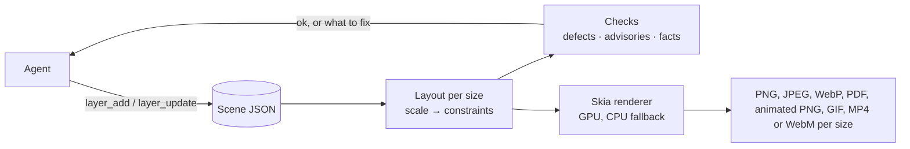

# keyline-mcp

[](https://github.com/keyline-dev/keyline/releases/latest)
[](https://github.com/keyline-dev/keyline/actions/workflows/ci.yml)
[](LICENSE.md)
[](https://registry.modelcontextprotocol.io/v0/servers?search=io.github.keyline-dev/keyline)

**[keyline.dev](https://keyline.dev)**: examples, the benchmark, and setup for every client.

**Design engine for AI agents: Canva for your agent.** keyline is a free MCP server for Claude Code, Claude Desktop, Cursor, Codex, Gemini CLI and any MCP client. Your agent describes a social post, ad or banner once, as a small JSON scene; keyline renders it as images and video at every size, with real text in your fonts and colors, the same every run.

**No browser, and fewer tokens.** No headless Chrome, Puppeteer or Playwright: one native Rust binary on [Skia](https://skia.org). Every edit replies with what's wrong at each size, so the agent fixes the design from measurements instead of screenshots: 2× fewer tokens than an agent driving headless Chrome, and 6× fewer than Playwright MCP ([benchmark](https://keyline.dev/benchmark/)).

<p align="center">One prompt, five sizes: the layout adapts from a 4:5 post to a 728×90 leaderboard, and keyline's checks catch what doesn't fit before anything renders.</p>

<p align="center">
  
</p>

<p align="center">
  <a href="https://keyline.dev/#gallery"></a>
  <a href="https://keyline.dev/#gallery"></a>
  <a href="https://keyline.dev/#gallery"></a>
  <a href="https://keyline.dev/#gallery"></a>
</p>

<p align="center">More campaigns, with motion, on <a href="https://keyline.dev/#gallery">keyline.dev</a>. Every image there, and the one above, was made with keyline.</p>

---

## Why

Most designs people ship today (sale posts, event flyers, ad sets) are made in tools like Canva or Adobe Express. Those tools are built for a person with a mouse, and none is a good backend for an agent:

- **Canva and Adobe Express** keep their scene graph private: you can export pixels, not the design.
- **Browser-based renderers** such as Polotno need headless Chrome on the server.

keyline-mcp is the missing piece: an agent-first design tool, with a design format and renderer built from the ground up for a language model to author, check and export, cheaply and reproducibly. The design stays structured data (a typed layer tree with layout, tokens, styles and components), not pixels, so an agent edits it precisely instead of regenerating an image.

## How it works



1. **One master layout.** A design is written once at a master size and lists its target sizes.
2. **Layouts that adapt.** Rows, columns, grids and design-tool constraints lay the design out again at every size, with no constraint solver; any layer can change for one size or aspect class.
3. **Checks, not previews.** Every edit's reply says what's wrong at each size, with the measurement that fixes it.
4. **GPU by default, deterministic when it matters.** Renders run on the GPU and fall back to the CPU, whose output is exactly repeatable.

**Start here:** [docs/concepts.md](docs/concepts.md) explains the model; [docs/scene.md](docs/scene.md) is the scene format and [docs/tools.md](docs/tools.md) the tools and configuration.

## LLM-first, and LLM-only

There's no GUI, and no plan for one. Every design decision is judged by one question: *how many tokens does the agent spend to get a correct image?* We measure that with a real model (Claude, through Claude Code) building a real multi-section ad.

- **Few, batched tools:** six tools, not one per property; one call can build a whole ad.
- **Short replies:** edits return the changed ids, a version, and `ok` or the problems, never the scene.
- **Defaults left out:** a typical layer is 4–6 fields.
- **Standard names:** CSS names and values wherever CSS has the concept (flexbox and grid fields on frames, `fontWeight`, `borderRadius`, `rgba()` colors), so the model writes a scene right the first time. The layout itself is keyline's own, documented, not browser-exact.
- **Semantic targets:** layers are addressed by `role`, so the agent never reads the scene to find an id.
- **Verification without pixels:** defects to fix, advisories to judge and facts to weigh, each with the measurement that fixes it ([how](docs/concepts.md#checks-defects-advisories-facts)).
- **Names, not inventions:** icons, shapes, styles, tokens and components by name. Icons alone took rebuilding a real flyer from $0.22–0.62 to $0.15–0.19 per run.
- **Measured, not guessed:** every change is judged on several real-model runs, kept in [keyline-bench](https://github.com/keyline-dev/keyline-bench).
- **Taste stays with the model:** the server flags only objective defects and reports the rest as facts.

## Features

- **Layers:** `text`, `image` (PNG, JPEG, SVG), `video`, `icon`, `rect`, `ellipse` (and arcs and rings), `polygon` (and stars), `path` (SVG path data or a named shape), `line`, `frame` (nesting, clipping, stacks, grids), `spacer`, `firstFit`, and `use` for components
- **Layout:** stacks (CSS flexbox: rows and columns with gap, padding, alignment, justification and wrapping; `fill`, `flexGrow` and priorities), grids (CSS grid: tracks, named areas, spans), `hug`/`fill`/percentage sizes with min/max and aspect ratio, direction lists and `firstFit` that pick what fits, constraints, placement at nine spots, a scale factor per size, per-size and per-aspect changes (`media`), size presets for common social and ad formats, and safe areas a platform covers
- **Text:** fit, wrap or one line; inline markup (`<b>`, `<i>`, `<span style=…>`, style names as tags); weights, italics, letter spacing, line height, case; balanced or pretty wrapping; highlights behind words; underline and strike; text on a curve; dot leaders; text filled with an image, pattern or gradient; outlines; text that knocks out its frame. Fonts work like CSS web fonts: name any [Google Fonts](https://fonts.google.com) family and the server downloads it on first use and caches it (tracked in `fonts/index.json`); [Inter](https://rsms.me/inter/) is bundled, and you can add your own font files
- **Paint:** stacked fills (solid, linear/radial/conic gradients, images, patterns, film grain), strokes (inside, center or outside, per side, dashed, with arrowheads, hand-drawn), shadows (outer and inner, following a cutout's or text's shape), blur and backdrop blur, masks (gradient, shape, path, another layer or an image), torn edges, 16 blend modes, corner radius, rotation, skew, flips
- **Images:** fill, fit, crop or tile, with a focus point that stays in view; adjustments (brightness, contrast, saturation, grayscale, sepia, hue, duotone, tint, halftone)
- **Icons:** about 5,000 built in, by name: [Lucide](https://lucide.dev) outline icons and [Font Awesome Free](https://fontawesome.com) solid, regular and brand icons, in any color
- **Reuse:** named styles on any layer, tokens (`{{brand}}`, in any field or sentence) that update every field using them, components placed once or once per data row, and templates: a scene file loaded by URL or path with its variables set, rendered once per row of values
- **Motion:** GSAP-style animation: enter and exit effects (fade, fade-up, pop, zoom, blur-in), keyframes on opacity, scale, rotation, offset, skew, blur and color with GSAP's eases, `random()` starts, staggered children, text split into letters or words that move on their own, strokes that draw themselves, and numbers that count
- **Video:** video clips as layers, trimmed, slowed or looped, with titles and graphics over them; shots that play in turn, joined by cuts, fades, slides, pushes, wipes or zooms; each clip's own sound carried into the video, mixed with a soundtrack
- **Assets:** stored under content hashes. URLs are fetched only over http(s), and private and local addresses are refused.
- **Output:** PNG, JPEG, WebP, vector PDF, animated PNG, animated GIF, MP4 or WebM per size, a still of any moment, with a file-size cap for ad networks, plus an optional contact-sheet preview; rendered on the GPU when available

## Quick start

### Claude Code and Claude Desktop

Nothing else to install.

**Claude Code:** install the plugin. It uses `keyline-mcp` from your PATH if it's there, and otherwise downloads the matching release once and checks it against the release's `SHA256SUMS`.

```text
/plugin marketplace add keyline-dev/keyline
/plugin install keyline@keyline
```

**Claude Desktop** (Mac with Apple silicon, or Windows): download `keyline-mcp-<version>.mcpb` from the [latest release](https://github.com/keyline-dev/keyline/releases/latest) and double-click it. Its settings pick the folders keyline may read and whether to leave motion out.

### Other clients: install, then add

**macOS** (Apple silicon):

```sh
brew install keyline-dev/tap/keyline-mcp
```

Or download `keyline-mcp-<version>-macos-arm64.tar.gz` from the [latest release](https://github.com/keyline-dev/keyline/releases/latest) and put the binary on your PATH. It isn't signed by Apple, so if you downloaded it in a browser, clear the quarantine flag once:

```sh
tar xzf keyline-mcp-<version>-macos-arm64.tar.gz
sudo mv keyline-mcp-<version>-macos-arm64/keyline-mcp /usr/local/bin/
xattr -d com.apple.quarantine /usr/local/bin/keyline-mcp 2>/dev/null || true
```

**Linux** (amd64 or arm64): the `.deb` from the [latest release](https://github.com/keyline-dev/keyline/releases/latest) puts `keyline-mcp` in `/usr/bin`; a plain tarball is there too.

```sh
sudo apt install ./keyline-mcp_<version>-1_amd64.deb
```

**Windows** (x64; Arm runs it emulated): download `keyline-mcp-<version>-windows-amd64.zip` from the [latest release](https://github.com/keyline-dev/keyline/releases/latest), unpack it, and put the folder holding `keyline-mcp.exe` on your PATH, or give clients its full path. The Claude Code plugin doesn't run on Windows yet; add the server with `claude mcp add keyline -- keyline-mcp` instead.

**Docker** (Linux, nothing else to install): use this as the command in your client. `:latest` includes ffmpeg for video; `:stills` leaves it out and is about a third the size.

```sh
docker run -i --rm -v keyline:/data ghcr.io/keyline-dev/keyline-mcp
```

**From source** (any OS; Rust stable; Skia comes precompiled; on Linux also `libfontconfig1-dev libfreetype6-dev`): `cargo build --release`.

To check a download, compare it with the release's `SHA256SUMS`, or check where it was built with the [GitHub CLI](https://cli.github.com); then check it runs with `keyline-mcp --help`:

```sh
sha256sum --check --ignore-missing SHA256SUMS      # macOS: shasum -a 256 --check --ignore-missing SHA256SUMS
gh attestation verify keyline-mcp_<version>-1_amd64.deb --repo keyline-dev/keyline
```

Then add it to your client. Each block names the server `keyline`; clients prefix its tools with that name, so a short one costs fewer tokens. If a client can't find the program, give its full path (`which keyline-mcp`).

<details>
<summary><b>Claude Code</b>, without the plugin</summary>

```sh
claude mcp add keyline -- keyline-mcp
```

Add `--scope user` to use it in every project. ([guide](https://code.claude.com/docs/en/mcp))
</details>

<details>
<summary><b>Claude Desktop</b>, without the extension</summary>

Settings → Developer → Edit Config opens `claude_desktop_config.json`. Claude Desktop doesn't search your shell's PATH, so give the full path, then restart it. ([guide](https://modelcontextprotocol.io/quickstart/user))

```json
{ "mcpServers": { "keyline": { "command": "/opt/homebrew/bin/keyline-mcp" } } }
```
</details>

<details>
<summary><b>Cursor</b></summary>

[Add to Cursor](https://cursor.com/en/install-mcp?name=keyline&config=eyJjb21tYW5kIjoia2V5bGluZS1tY3AifQ%3D%3D), or add to `~/.cursor/mcp.json` (every project) or `.cursor/mcp.json` (one project). ([guide](https://cursor.com/docs/context/mcp))

```json
{ "mcpServers": { "keyline": { "command": "keyline-mcp" } } }
```
</details>

<details>
<summary><b>VS Code</b></summary>

```sh
code --add-mcp '{"name":"keyline","command":"keyline-mcp"}'
```

Or add to `.vscode/mcp.json`, or your profile's (*MCP: Open User Configuration*). The key is `servers`, not `mcpServers`. ([guide](https://code.visualstudio.com/docs/copilot/customization/mcp-servers))

```json
{ "servers": { "keyline": { "type": "stdio", "command": "keyline-mcp" } } }
```
</details>

<details>
<summary><b>Devin Desktop</b> (formerly Windsurf)</summary>

Add to `~/.config/devin/mcp_config.json` (Windows: `%APPDATA%\devin\mcp_config.json`); versions still named Windsurf read `~/.codeium/windsurf/mcp_config.json`. ([guide](https://docs.devin.ai/desktop/cascade/mcp))

```json
{ "mcpServers": { "keyline": { "command": "keyline-mcp" } } }
```
</details>

<details>
<summary><b>Cline</b></summary>

In Cline's MCP Servers panel, open the installed servers' settings (`cline_mcp_settings.json`) and add: ([guide](https://docs.cline.bot/mcp/configuring-mcp-servers))

```json
{ "mcpServers": { "keyline": { "command": "keyline-mcp" } } }
```
</details>

<details>
<summary><b>Codex</b> (OpenAI)</summary>

```sh
codex mcp add keyline -- keyline-mcp
```

Or add to `~/.codex/config.toml`: ([guide](https://developers.openai.com/codex/mcp))

```toml
[mcp_servers.keyline]
command = "keyline-mcp"
```

The ChatGPT app itself connects only to remote MCP servers over HTTP, so it can't start keyline, which runs on your machine; use Codex.
</details>

<details>
<summary><b>Gemini CLI</b> (Google)</summary>

```sh
gemini mcp add --scope user keyline keyline-mcp
```

Or add to `~/.gemini/settings.json`, then check with `/mcp` in Gemini CLI: ([guide](https://geminicli.com/docs/tools/mcp-server/))

```json
{ "mcpServers": { "keyline": { "command": "keyline-mcp" } } }
```
</details>

<details>
<summary><b>Antigravity</b> (Google)</summary>

Add to `~/.gemini/config/mcp_config.json` (every workspace) or `.agents/mcp_config.json` (one workspace). ([guide](https://antigravity.google/docs/mcp))

```json
{ "mcpServers": { "keyline": { "command": "keyline-mcp" } } }
```
</details>

<details>
<summary><b>GitHub Copilot CLI</b></summary>

Run `/mcp add` in Copilot CLI, or add to `~/.copilot/mcp-config.json`: ([guide](https://docs.github.com/en/copilot/how-tos/use-copilot-agents/use-copilot-cli))

```json
{ "mcpServers": { "keyline": { "type": "local", "command": "keyline-mcp", "args": [], "tools": ["*"] } } }
```
</details>

<details>
<summary><b>Grok Build</b> (xAI)</summary>

```sh
grok mcp add keyline -- keyline-mcp
```

Or add to `~/.grok/config.toml`, then check with `grok mcp doctor keyline`: ([guide](https://docs.x.ai/build/features/mcp-servers))

```toml
[mcp_servers.keyline]
command = "keyline-mcp"
```

grok.com and the xAI API connect only to remote MCP servers, so they can't start keyline; use Grok Build.
</details>

<details>
<summary><b>Kiro</b></summary>

Add to `~/.kiro/settings/mcp.json` (every workspace) or `.kiro/settings/mcp.json` (one workspace). ([guide](https://kiro.dev/docs/mcp/configuration/))

```json
{ "mcpServers": { "keyline": { "command": "keyline-mcp" } } }
```
</details>

<details>
<summary><b>opencode</b></summary>

Add to `~/.config/opencode/opencode.json`, or `opencode.json` in a project. The command is a list. ([guide](https://opencode.ai/docs/mcp-servers/))

```json
{ "$schema": "https://opencode.ai/config.json", "mcp": { "keyline": { "type": "local", "command": ["keyline-mcp"] } } }
```
</details>

<details>
<summary><b>JetBrains</b> (AI Assistant and Junie)</summary>

AI Assistant: Settings → Tools → AI Assistant → Model Context Protocol (MCP) → Add, and paste the JSON below. ([guide](https://www.jetbrains.com/help/ai-assistant/configure-an-mcp-server.html)) Junie: run `/mcp`, or add the same JSON to `~/.junie/mcp/mcp.json`. ([guide](https://junie.jetbrains.com/docs/junie-cli-mcp-configuration.html))

```json
{ "mcpServers": { "keyline": { "command": "keyline-mcp", "args": [] } } }
```
</details>

<details>
<summary><b>Warp</b></summary>

Settings → Agents → MCP servers → Add, and paste: ([guide](https://docs.warp.dev/knowledge-and-collaboration/mcp))

```json
{ "keyline": { "command": "keyline-mcp", "args": [] } }
```
</details>

<details>
<summary><b>Any other client</b></summary>

Any MCP client that starts stdio servers works: the command is `keyline-mcp`. It runs where the client runs; to render on another machine, make the command `ssh that-machine keyline-mcp`.
</details>

### Then

Ask your agent for a design: *"Make a vote-by-mail flyer with this photo, in 1080×1350, 1200×1000 and a 300×600 skyscraper."*

**Local files:** to let the agent add images and templates by path (their bytes never pass through the model, far cheaper than base64), allow their folders: `--allow-read ~/brand ~/projects/ads`. With `claude mcp add`, flags go after the command (`claude mcp add keyline -- keyline-mcp --allow-read ~/brand`); in a JSON config, in `args`. Paths are resolved through every symlink before the check. In Docker, mount the folder and allow the mount: `-v ~/brand:/brand … --allow-read /brand`.

**Video** needs [ffmpeg](https://ffmpeg.org) (`brew install ffmpeg`, `apt install ffmpeg`), looked up when a call needs it. It's optional: without it, everything else works, animated PNG and GIF included.

**Options:** every setting is a flag (`--allow-read`, `--no-motion`, `--data`, `--fonts`, `--renderer`, `--ffmpeg`, `--encoder`), listed in [docs/tools.md](docs/tools.md#server-configuration) and by `keyline-mcp --help`.

**Without an agent:** `keyline-mcp render scene.json --out renders/` renders a scene file at every size, and exits 1 on a `!` defect, for scripts and CI (`--check` checks without drawing); in GitHub Actions, `uses: keyline-dev/keyline@v0` does it for every scene in a repo ([docs/tools.md](docs/tools.md#rendering-without-an-agent)).

**GPU on a Linux server:** it needs a GPU with Vulkan drivers (NVIDIA's, or Mesa for AMD and Intel); no display is needed. In Docker, pass the GPU through (for NVIDIA: the Container Toolkit, `--gpus all`, with graphics capability). Software Vulkan drivers are skipped, since the CPU renderer is faster; without a GPU, renders use the CPU.

## The tools

Every input and reply format is in [docs/tools.md](docs/tools.md).

| Tool | Does | Replies |
|---|---|---|
| `scene_create` | New scene: master size, target sizes, background; or from a template file by URL or path, with its variables set | `s5b0a42a5e v0` |
| `asset_add` | Adds an image or video clip from a URL, a local path or base64 | `photo 1600×900 v1` |
| `layer_add` | Adds layers, optionally into a `parent` frame, and shared `styles`, `tokens` and `components` | `added headline,cta v2 ok` and facts |
| `layer_update` | Changes (`set`), deletes or detaches layers, styles and components; changes tokens | `changed … v3`, then problems or `ok` |
| `scene_describe` | Problems per size, or `ok`; `full` lists every layer's box | text |
| `render` | PNG, JPEG, WebP, PDF, animated PNG, GIF, MP4 or WebM for all or some sizes, or a still at `time`; `rows` renders one variant per row of variables; `maxKB` caps file size; `preview` adds a contact sheet | paths and how text was drawn |

A typical call:

```json
{
  "sceneId": "s5b0a42a5e",
  "layers": [
    {
      "id": "headline",
      "type": "text",
      "x": 60,
      "y": 40,
      "width": 960,
      "fontSize": 64,
      "fontWeight": 800,
      "textAlign": "center",
      "color": "#1B2A5C",
      "text": "Proven <span style=\"color:#D0202E\">RESULTS</span> for WILLOWMERE Families",
      "constraints": {
        "horizontal": "stretch",
        "vertical": "top"
      }
    },
    {
      "type": "image",
      "asset": "photo",
      "y": 220,
      "width": 1080,
      "height": 460,
      "constraints": {
        "horizontal": "stretch",
        "vertical": "stretch"
      }
    },
    {
      "id": "cta",
      "type": "frame",
      "y": 830,
      "width": 1080,
      "height": 100,
      "fill": "#D0202E",
      "constraints": {
        "horizontal": "stretch",
        "vertical": "bottom"
      },
      "children": [
        {
          "id": "cta-text",
          "type": "text",
          "text": "VOTE BY MAIL",
          "x": 394,
          "y": 21,
          "fontSize": 48,
          "fontWeight": 800,
          "color": "#FFFFFF",
          "constraints": {
            "horizontal": "center",
            "vertical": "center"
          }
        }
      ]
    }
  ]
}
```

and its reply, for the sizes the tests use (1080×1350 at full scale, 1200×1000 at 0.85, a 300×600 skyscraper at 0.28):

```text
added headline,image1,cta v2 ok
smallest text: portrait 48px (cta-text), wide 41px (cta-text), sky 13px (cta-text)
```

## Development

```sh
cargo test                                         # unit and end-to-end tests
UPDATE_GOLDEN=1 cargo test --test e2e              # regenerate reference PNGs (deliberately; also e2e_features, e2e_paint, …)
cargo test --test llm_e2e -- --ignored --nocapture # a real model builds an ad; prints cost
cargo test -- --ignored web_fonts google_fonts     # web fonts download once and stay cached (network)
KEYLINE_MCP_BENCH=<label> cargo test --test llm_e2e -- --ignored --nocapture       # keep the run in ../keyline-bench/reference-ad/
KEYLINE_MCP_BENCH=<label> cargo test --test recreate_e2e -- --ignored --nocapture  # rebuild a local design from its image, scored
```

- **Unit tests** cover layout, text fitting, rendering down to pixel checks, storage, URL safety and edits.
- **Layout tests** check every layer's position and size after layout, without rendering.
- **End-to-end tests** run the real server over stdio, build designs in several sizes, and compare the PNGs with reference images. The images are kept per OS, since glyph rasterization differs by platform, and compared with a small tolerance, since glyph edges also differ slightly between OS versions.
- **The LLM tests** run Claude Code headless, so they use a Claude subscription and need no API key. They check that no defects remain and report tool calls, tokens and API-equivalent cost. With `KEYLINE_MCP_BENCH` they keep each run for comparison: the reference ad in [keyline-bench](https://github.com/keyline-dev/keyline-bench) (checked out beside this repo, or at `KEYLINE_BENCH`), and a design rebuilt from its image (kept in the gitignored `bench/recreate/local/`, since references are often real people's material), scored by how close it looks.
- **Releases:** pushing a `v*` tag builds the Linux `.deb` and tarball (amd64 and arm64) and attaches them to a GitHub release.

Contributions follow [CLAUDE.md](CLAUDE.md): Rust only, `cargo fmt` and `clippy -D warnings` must pass, changes are reviewed against the [rust-skills](https://github.com/leonardomso/rust-skills) rules, new dependencies need approval and must be permissively licensed, and every feature comes with unit and end-to-end tests.

## License

[Functional Source License 1.1, Apache 2.0 future license](LICENSE.md) (FSL-1.1-ALv2): free to use, modify and redistribute, commercially too, for any purpose **except a competing use: making keyline available to others in a commercial product or service that substitutes for it or offers substantially the same functionality**, which includes offering it as a hosted service. Your own internal use, research, education and work for clients are all allowed. **Two years after each release, that release is also available under the [Apache License 2.0](https://www.apache.org/licenses/LICENSE-2.0).** For a license to compete, contact the author.

Contributions are welcome under the [contributor agreement](CONTRIBUTING.md#contributor-agreement): contributors assign the copyright in their changes to the author.

Third-party parts keep their own licenses: Skia (BSD-3-Clause) through the skia-safe bindings (MIT), resvg (Apache-2.0 or MIT), rmcp (Apache-2.0), csscolorparser (MIT or Apache-2.0), Inter ([SIL OFL 1.1](fonts/OFL.txt)), Lucide icons ([ISC](icons/LICENSE-lucide.txt)) and Font Awesome Free icons by Fonticons, Inc. ([CC BY 4.0](icons/LICENSE-fontawesome.txt)).
